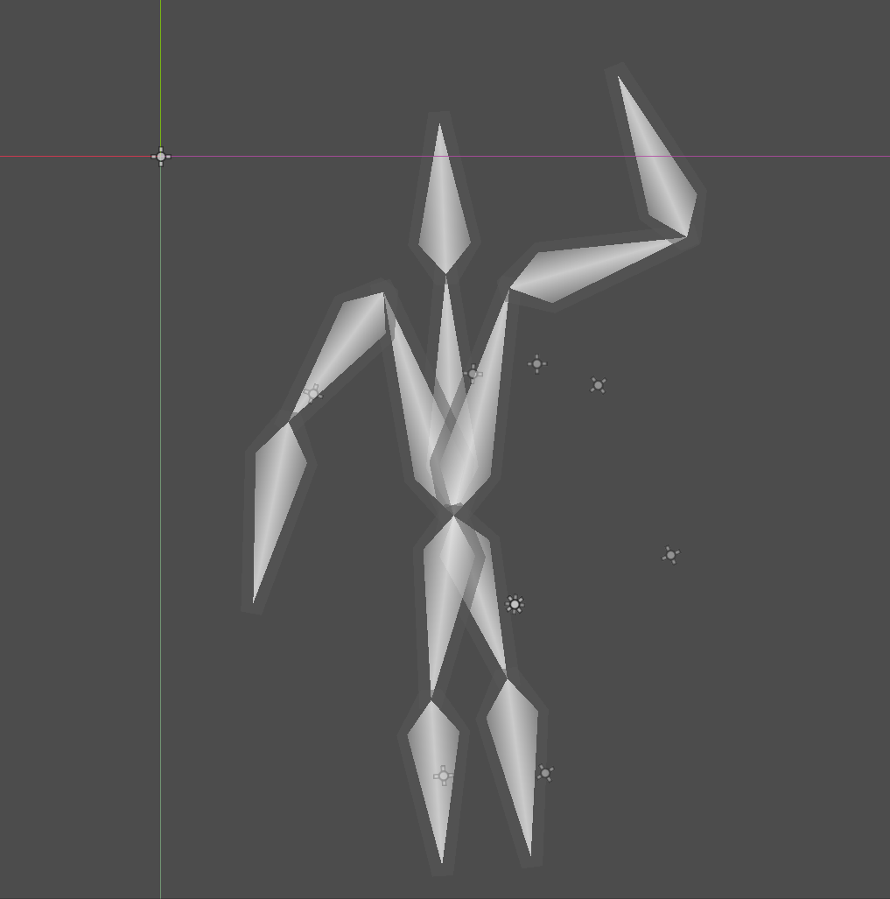

# PipeDoll

PipeDoll is a 2D motion capture animation addon for the [Godot Game Engine](https://godotengine.org/).
It uses [Google's MediaPipe library](https://google.github.io/mediapipe/) to capture motion data using a standard webcam.

See the [Usage Tutorial](https://github.com/ectucker1/pipedoll/wiki/PipeDoll-Tutorial) to get started.

## Installation

PipeDoll includes both a [Godot Extension](https://docs.godotengine.org/en/stable/tutorials/scripting/gdextension/what_is_gdextension.html) and a plugin. They can both be installed together by just copying the project files.

1. Download the latest PipeDoll release from https://github.com/ectucker1/pipedoll/releases.
2. Extract the downloaded PipeDoll.v1.0.0.zip file.
3. Copy the contents of the folder to the root of your Godot project. `mediapipe_models` and `mediapipe_graphs` should be in the project root, while `pipedoll` should be in the `addons` folder.
4. Enable the `PipeDoll` plugin in your Project Settings.

## Screenshots

